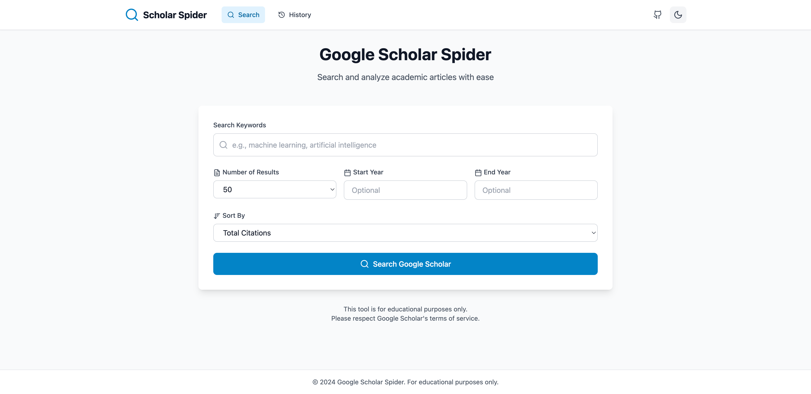

# ScholarDock - 学術文献検索分析システム

<p align="center">
  <a href="README.md">English</a> •
  <a href="README_CN.md">中文</a> •
  <a href="README_JP.md">日本語</a>
</p>

## 📖 はじめに

ScholarDockは、Google Scholarから学術論文データを取得し、強力な分析・可視化機能を提供する最新の学術文献検索分析システムです。

### ✨ 主な機能

- 🔍 **スマート検索**：キーワード、年代範囲などの多次元検索をサポート
- 📊 **データの可視化**：引用傾向グラフ、発表時期分析など
- 💾 **データ管理**：検索履歴の保存、複数形式でのエクスポート（CSV/JSON/Excel/BibTeX）
- 🎨 **モダンなインターフェース**：レスポンシブデザイン、ダークモード、スムーズなアニメーション
- 🚀 **高性能**：非同期バックエンド、効率的なデータ取得

## 📸 スクリーンショット

### ホームページ


### 検索結果とデータ可視化


## 🛠️ 技術スタック

- **バックエンド**：FastAPI + SQLAlchemy + BeautifulSoup4
- **フロントエンド**：React + TypeScript + Tailwind CSS
- **データベース**：SQLite（ローカルストレージ）
- **可視化**：Chart.js

## 📋 動作環境

- Python 3.8以上
- Node.js 16以上
- Chrome/Chromiumブラウザ（Selenium用）

## 🚀 クイックスタート

### 1. プロジェクトのクローン

```bash
git clone https://github.com/JessyTsui/scholardock.git
cd scholardock
```

### 2. 依存関係のインストール

#### バックエンドの依存関係
```bash
cd backend
pip install -r requirements.txt
cd ..
```

#### フロントエンドの依存関係
```bash
cd frontend
npm install
cd ..
```

### 3. システムの起動

```bash
# プロジェクトルートディレクトリで実行
python start.py
```

またはショートカットスクリプトを使用：
```bash
./run.sh  # Linux/Mac
```

### 4. システムへのアクセス

起動に成功したら、以下のアドレスにアクセスします：
- 🌐 **フロントエンドインターフェース**：http://localhost:3000
- 📡 **バックエンドAPI**：http://localhost:8001
- 📚 **APIドキュメント**：http://localhost:8001/docs

## 📖 使用ガイド

### 論文検索

1. ホームページで検索キーワードを入力
2. オプション：年代範囲と結果数を設定
3. ソート方法を選択（引用数、年間平均引用数など）
4. 検索ボタンをクリック

### 結果の表示

- 論文リストを閲覧（タイトル、著者、引用数などの情報を含む）
- タイトルをクリックして原文リンクにアクセス
- フィルターを使用して結果をさらに絞り込む

### データ分析

- 引用傾向グラフの表示
- 年間発表数の分布を分析
- 高影響力論文の特定

### データのエクスポート

複数形式でのエクスポートをサポート：
- **CSV**：Excel分析に適している
- **JSON**：プログラム処理用
- **Excel**：完全なスプレッドシートファイル
- **BibTeX**：LaTeX引用用

## 🔧 設定オプション

### バックエンド設定

`backend/core/config.py`を編集するか`.env`ファイルを作成：

```env
DATABASE_URL=sqlite+aiosqlite:///../data/scholar.db
REQUEST_DELAY=5.0
MAX_RETRIES=3
USE_SELENIUM_FALLBACK=true
```

### フロントエンド設定

`frontend/vite.config.ts`でプロキシとポートを設定。

## 🐛 よくある問題

### 検索結果がない

- 原因：Google Scholarが自動アクセスを検出
- 解決策：しばらく待ってから再試行するか、別のキーワードを使用

### ポートが占有されている

- エラー：`Port already in use`
- 解決策：`./stop.sh`を実行するか、手動でポートを占有しているプロセスを終了

### 依存関係のインストール失敗

- PythonとNode.jsのバージョンが要件を満たしていることを確認
- 国内ミラーソースを使用してダウンロードを高速化

## 🤝 貢献ガイド

IssueとPull Requestの提出を歓迎します！

1. このプロジェクトをフォーク
2. 機能ブランチを作成 (`git checkout -b feature/AmazingFeature`)
3. 変更をコミット (`git commit -m '素晴らしい機能を追加'`)
4. ブランチにプッシュ (`git push origin feature/AmazingFeature`)
5. Pull Requestを作成

## 📄 ライセンス

このプロジェクトはMITライセンスを採用しています - 詳細は[LICENSE](LICENSE)ファイルをご覧ください。

## 👏 謝辞

- FastAPIフレームワーク
- Reactコミュニティ
- すべての貢献者

## 📞 お問い合わせ

問題や機能リクエストは[GitHub Issues](https://github.com/JessyTsui/scholardock/issues)をご利用ください。